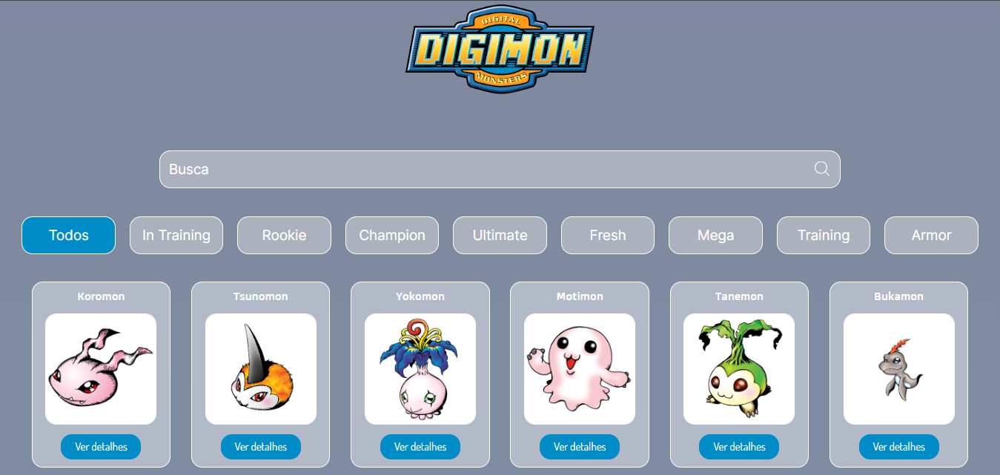

<h4 align="center">
    :computer: Aplicação para pesquisa de Digimon
</h4>

    <a href="#-projeto">Projeto</a>&nbsp;&nbsp;&nbsp;|&nbsp;&nbsp;&nbsp;
    <a href="#rocket-tecnologias">Tecnologias</a>&nbsp;&nbsp;&nbsp;|&nbsp;&nbsp;&nbsp;
    <a href="#user-content-clipboard-instruções">Instruções</a>&nbsp;&nbsp;&nbsp;|&nbsp;&nbsp;&nbsp;

 

## 💻 Projeto

Frontend App em ReactJS. Plataforma web responsiva para busca de personagens do anime Digimon. 

 

## :rocket: Tecnologias

- [Typescript](https://www.typescriptlang.org/)
- [ReactJS](https://pt-br.reactjs.org/)
- [styled-components](https://styled-components.com/)
---

## :clipboard: Instruções

### INTERFACE - FRONTEND

- Execute `$ npm i` para instalar todas as dependencias.
- Crie um arquivo `.env` e preencha as informações de cada variável de ambiente, as variáveis para serem preenchidas se encontram no arquivo `env.example`.
- Após todas as dependencias serem instaladas e as variáveis serem preenchidas, basta executar `npm run dev` para iniciar a interface frontend.

